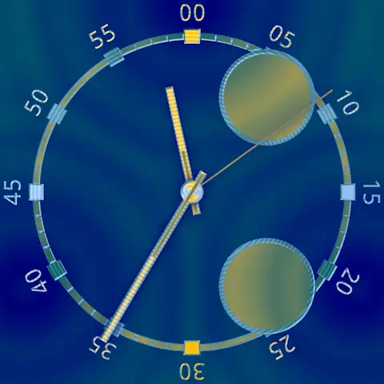

Watch Kit Pro 
=============

Watch face design kit for Wear OS

Introduction
------------

Watch Kit Pro allows you to custom-design your own watch faces for Wear OS smartwatches.

It allows you to tweak the watch hands, ticks and background. There are millions of combinations
for you to explore.

Watch Kit Pro is free to download and own forever. You don't need to pay for it. There's no catch.
There's no in-app purchases or paid upgrades. It's Free Software released to you under the GNU
General Public License 3.0.

Watch Kit Pro has the following features:

- Four watch face slots for you to store different watch faces
- Choose between different watch hand shapes
- Choose between different watch tick shapes, with optional digit display
- Choose between different background styles
- Choose four colors from a 64-color palette, and a multitude of style options
- Choose the typeface used for drawing text
- Configure up to 8 complications
- Always-on watch faces (a.k.a. "ambient mode")
- Choose day-time and night-time colors for always-on watch faces

In addition, Watch Kit Pro:

- Works with round and square smartwatches running Wear OS 2.0 or later
- Is compatible with Android and iOS smartphones
- Has no smartphone app; all configuration is done on your smartwatch
- Is designed for readability and legibility
- Is optimised for power efficiency to save battery energy
- Is optimised for size; only a 1 MB download (give or take)
- Uses emoji 😍
- Is free to download and own forever, with no in-app purchases or paid upgrades
- Is Free Software (GPL 3.0), with source code available for your use

For support, documentation and interesting information, visit https://watchkit.pro/

Watch Kit Pro was written by [Terence Tan](https://github.com/calroth), a Christian ✝ living in
Australia 🇦🇺

Screenshots
-----------

(The above images are in [WebP](https://developers.google.com/speed/webp) format as they're taken
from the source code directory; they're the same images compiled into the app. If you can't view
them, try browsing this site in Mozilla Firefox, Google Chrome or Microsoft Edge.)

Developers!
-----------

If you're reading this, you're probably interested in the source code. Maybe you're interested in
building it. Maybe you're interested in seeing how we solved a problem, or how we implemented
something of note, or what's changed recently. You're welcome to take a browse or a fork!

Watch Kit Pro uses the Gradle build system. To build this project, use the
"gradlew build" command or use "Import Project" in Android Studio.

Check the [Wearable/build.gradle](Wearable/build.gradle) file for the definitive version of the
pre-requisites. However they're probably:

- Android SDK 28
- Android Build Tools 29.0.2
- Android Support Repository

Support
-------

The Watch Kit Pro web site: https://watchkit.pro/

If you've found a defect in Watch Kit Pro, please file an issue:
https://github.com/calroth/watch-kit-pro/issues

Patches are encouraged, and may be submitted by forking this project and
submitting a pull request: https://github.com/calroth/watch-kit-pro/pulls

License
-------

Copyright (C) 2018-2019 Terence Tan

This file is free software: you may copy, redistribute and/or modify it
under the terms of the GNU General Public License as published by the
Free Software Foundation, either version 3 of the License, or (at your
option) any later version.

This file is distributed in the hope that it will be useful, but
WITHOUT ANY WARRANTY; without even the implied warranty of
MERCHANTABILITY or FITNESS FOR A PARTICULAR PURPOSE.  See the GNU
General Public License for more details.

You should have received a copy of the GNU General Public License
along with this program.  If not, see <http://www.gnu.org/licenses/>.

This file incorporates work covered by the following copyright and
permission notice:

> Copyright (C) 2017 The Android Open Source Project
>
> Licensed under the Apache License, Version 2.0 (the "License");
> you may not use this file except in compliance with the License.
> You may obtain a copy of the License at
>
> http://www.apache.org/licenses/LICENSE-2.0
>
> Unless required by applicable law or agreed to in writing, software
> distributed under the License is distributed on an "AS IS" BASIS,
> WITHOUT WARRANTIES OR CONDITIONS OF ANY KIND, either express or implied.
> See the License for the specific language governing permissions and
> limitations under the License.